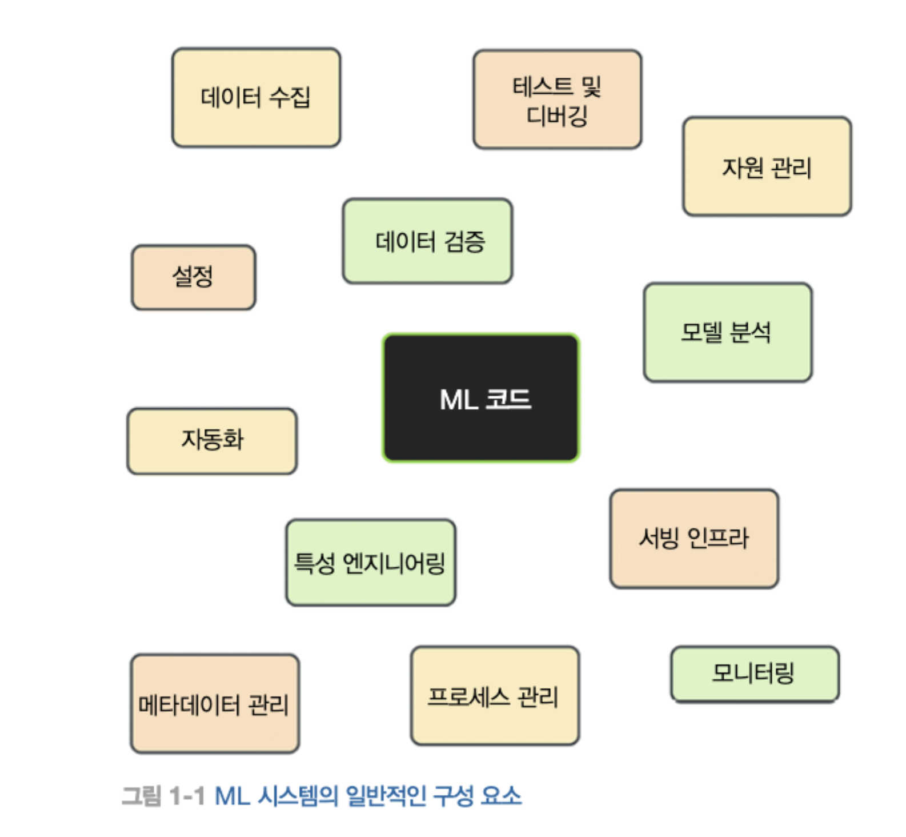
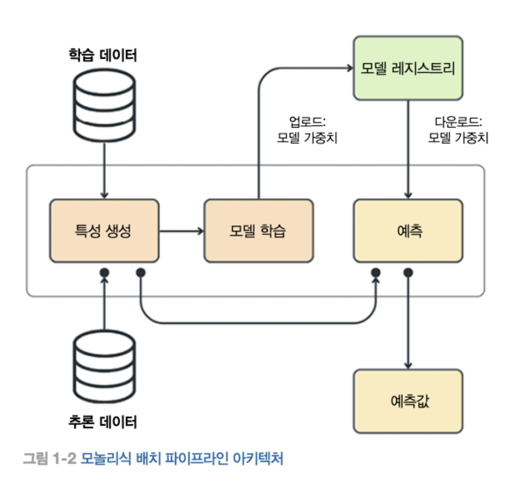
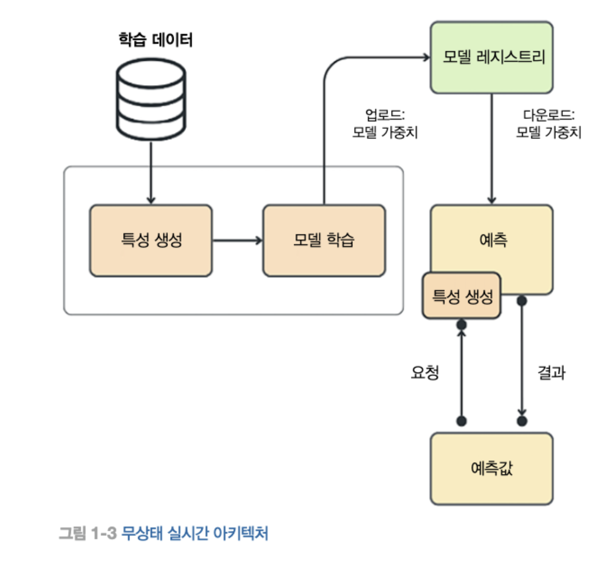
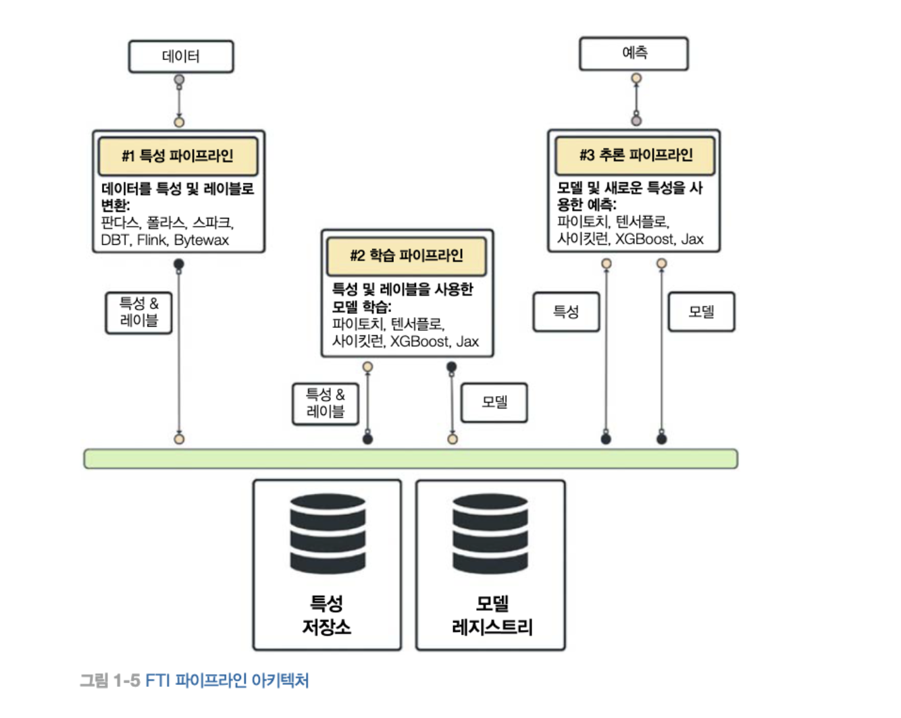
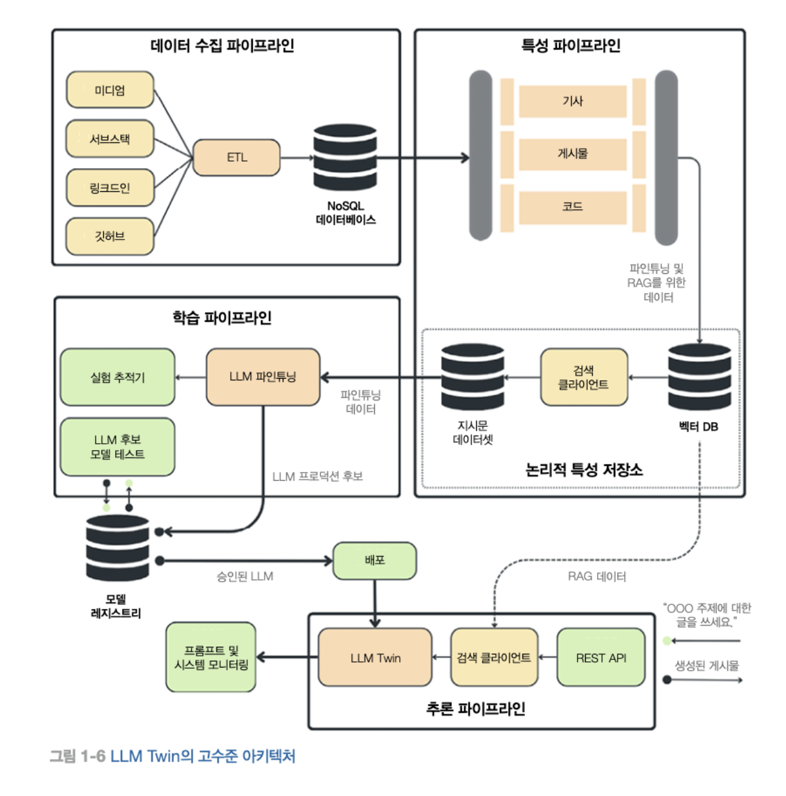

#
## 1.1 LLM Twin 개념
### 1.1.1 LLM 트윈이란?

 LLM에 자신의 글쓰기, 어조, 문체, 성격을 반영한 AI 페르소나
 자신의 데이터를 LLM에 파인튜닝한다

 style transfer
검색 증강 생성

###

코파일럿 vs LLM 트윈
코파일럿: 보조도구
LLM 트윈: 실제 대상의 1:1 디지털 표현

------------------
프롬프트 + 할루시네이션

데이터 중심이고 모델에 구현받지 않는 아키텍처가 중요하다.
-> LLM에 구애를 받지 않는다.

## 1.2 LLM Twin의 제품 기획

제품의 MVP 정의

### 1.2.1 MVP란?

- 데이터 수집
- 파인 튜닝
- LLM을 위한 벡터 DB에 데이터 저장
- 다음을 바탕으로 링크드인 게시물 생성
  - 사용자 프롬프트
  - RAG 기반 기존 콘텐츠 참조 및 재사용
  - 새로운 게시물 기사 논문을 LLM에 추가 지식으로 활용
- 아래와 같이 LLM 트윈과 상호작용 할 수 있는 간단한 웹 인터페이스 제공
  - 소셜 미디어 링크를 설정하고 데이터 수집 단계를 실행
  - 프롬프트나 외부 리소스를 전송

## 1.3 특성, 학습, 추론 기반 LLM 시스템

 ML 시스템 패턴: 특성, 학습, 추론 (FTI)

 

 ### 1.3.2 일반적인 ML아키텍처의 문제점

 FTI를 동일한 구성요소로 결합하는 모놀리식 배치 아키텍처 -> 학습 서빙 왜곡 해결 가능
동일한 코드로 학습 서빙을 하기 때문에 왜곡이 일어나지 않음

문제점
- 특성의 재사용성이 낮음
- 데이터 증가 시 파이스파크 또는 레이 사용을 위해 전반적인 코드 리팩터링 필요
- 예측 모듈을 C++, 자바, 러스트 등 더 효율적인 언어로 재작성이 힘듬
- 특성, 학습, 추론을 여러 팀이 작업하기 힘듬
- 실시간 학습을 위한 스트리밍 시스템으로 전환하기 어려움

클라이언트가 매번 상태를 전달하지 않아도 어떻게 예측에 필요한 모든 특성을 불러올 것인가.

### 1.3.3 ML 시스템을 위한 파이프라인

#### 특성 파이프라인

 원시 데이터를 입력받아서 처리한 후, 모델 학습이나 추론에 필요한 특성과 레이블을 출력. 특성과 레이블은 모델에 직접 연결되지 않고 특성 저장소에 저장된다. 특성 저장소는 특성 관리, 버전 관리, 추적 및 공유의 역할을 한다.

 데이터의 버전이 관리되므로 학습 및 추론의 시점의 특성이 일치하는지 항상 확인할 수 있다. 따라서 학습 서빙 외곡을 해결할 수 있다.

#### 학습 파이프라인

 저장된 특성으로 부터 하나 이상의 특성과 레이블을 가져온 후, 하나 이상의 학습 모델을 생성한다. 생성된 모델은 모델 레지스트리에 저장된다. 모델 레지스트리는 특성 저장소와 역할이 비슷하나 저장 대상이 모델이라는 점에서 차이가 있다. 모델 레지스트리에서 가장 중요한 것은 모델 학습에 사용된 특성 레이블 및 버전 기록이다. 이를 바탕으로 모델이 어떤 데이터를 기반으로 학습 되었는지 언제든지 확인할 수 있다.

#### 추론 파이프라인

특성 저장소와 특성과 레이블, 모델 레지스트리의 학습된 모델을 입력값으로 받는다. 이 두가지를 사용하면 실시간 예측 또는 배치를 쉽게 수행할 수 있다. 배치 시스템에서는 예측 결과를 DB에 저장한다. 실시간 처리 시스템에서는 예측 결과를 클라이언틑에 전달한다. 모델과 특성간의 관계를 알고 있기 때문에 모델과 특성간의 연결을 빠르게 변경할 수 있다.

### 1.3.4 FTI 아키텍처의 이점

FTI 아키텍처는 논리적인 계층 역할을 한다.
각 구성 요소는 독립적으로 개발 및 업데이트 할 수 있다.

=> ML Ops에 마이크로 서비스를 적용한 느낌 같은데?

## 1.4 LLM Twin 아키텍처 설계

### 1.4.1 LLM Twin의 기술적 요구사항

데이터 측면
- 데이터 소스로 부터 일정 간격으로 데이터 수집
- 크롤링된 데이터를 표준화해서 데이터 웨어하우스에 저장
- 원시 데이터를 정제
- LLM파인 튜닝을 위한 지시문 데이터셋 생성
- 정제된 데이터셋을 청킹, 임베딩(텍스트를 벡터화 하는 것) 한다.
- 백터화된 데이터를 RAG용 벡터 DB에 저장한다.
학습 측면
- 다양한 크기의 LLM 파인 튜닝
- 다양한 크기의 지시문 데이터셋에 대한 파인튜닝
- 다양한 LLM간의 전환 (라마, GPT)
- 배포 전 프로덕션용 LLM 후보 테스트
- 새로운 지시문 데이터셋 준비 시 자동으로 학습 시작
추론 측면
- 클라이언트가 LLM Twin과 상호작용할 수 있는 Restful api
- RAG를 위한 실시간 백터 DB 엑세스
- 다양한 크기의 LLM을 사용한 추론
- 사용자 요청에 따른 자동 스케일링
- 평가 단계를 통과한 LLM의 자동 배포
LLM Ops 구현을 위한 기능
- 지시문 데이터셋 버전 관리, 계보 및 재사용성
- 모델 버전 관리, 계보 및 재사용성
- 실험 추적
- 지속적 학습(CT), 지속적 통합(CI), 지속적 배포(CD) 
- 프롬프트 및 시스템 모니터링

### 1.4.2 FTI 파이프라인을 사용해 LLM Twin 아키텍처를 설계하는 방법

#### 데이터 수집 파이프라인
- 추출, 변환, 적제 (ETL) 패턴을 사용해, 데이터를 추출하고 표준화 하여 데이터 웨어하우스에 적재한다.
- NOSQL에 적재

#### 특성 파이프라인

- 데이터 웨어하우스에서 원시 데이터를 가져와서 처리한 다음 특정 저장소에 저장하는 것.
- 파인 튜닝 및 RAG에 필요한 정제, 청킹, 임베딩 등을 포함
- 파인튜닝, RAG에 사용할 디지털 데이터 스냅샷을 각각 생성
- 전문적인 특성 저장소 대신 논리적인 저장소 생성

벡터 DB: NOSql처럼 id로 데이터에 접근 가능
이를 통해 백터 검색 로직 없이도 새 데이터 포인트를 백터 DB에서 쉽게 조회 가능
- 나중에는 이렇게 조회한 데이터를 버전관리, 추적, 공유가 가능한 이티팩트화

#### 학습 파이프라인

- 특성 저장소의 지시문 데이터셋 사용
- LLM을 파인 튜닝, 조정된 LLM 가중치를 모델 레지스트리에 저장.
- 최적의 하이퍼 파라미터를 DS팀에서 최초로 생성 및 저장. 자동화(재사용) 작업 준비

- 테스트 파이프라인은 파인튜닝 과정을 거친 모델이 현재 프로덕션 모델보다 더 나은지 평가한다.
- 이 과정을 통과하면 후보 모델은 프로덕션 모델로 통과된 것으로 최종 승인되고 프로덕션에 배포된다.

• 특정 LLM에 구애받지 않는 파이프라인을 어떻게 구현할 것인가?
• 어떤 파인튜닝 기술을 사용할 것인가?
• 다양한 크기의 LLM과 데이터셋에 대해 파인튜닝 기술을 어떻게 확장할 것인가?
• 여러 실험 결과 중 어느 LLM을 프로덕션 후보로 선택할 것인가?
• LLM을 프로덕션으로 배포할지를 결정하기 위해 어떻게 테스트할 것인가?

지속적 학습(CT): 모듈형 설계는 ML 오케스트 레이터를 활용해 다양한 시스템의 구성 요소를 적절한 시점에 스케줄링하고 트리거할 수 있도 록 한다.

#### 추론 파이프라인

추론 파이프라인은 마지막 퍼즐 조각이다. 이 파이프라인은 모델 레지스트리와 논리적 특성 저 장소에 연결된다. 모델 레지스트리에서 파인튜닝된 LLM을 로드하고, 논리적 특성 저장소를 통 해 RAG용 벡터 DB에 접근한다. 클라이언트 요청은 REST API를 통해 쿼리로 받는다. 그런 다음, 파인튜닝된 LLM과 벡터 DB 접근을 활용해 RAG를 수행하고 쿼리에 대한 답변을 제공 한다.

LLM과 RAG 시스템의 독특한 특징을 관찰할 수 있다.
• RAG를 위한 벡터 검색을 수행하는 검색 클라이언트
• 사용자 쿼리와 외부 정보를 LLM에 전달하고 지시하는 프롬프트 템플릿
• 프롬프트 모니터링을 위한 도구

### 1.4.3 FTI 파이프라인 설계와 LLM Twin 아키텍처에 대한 조언

### 
