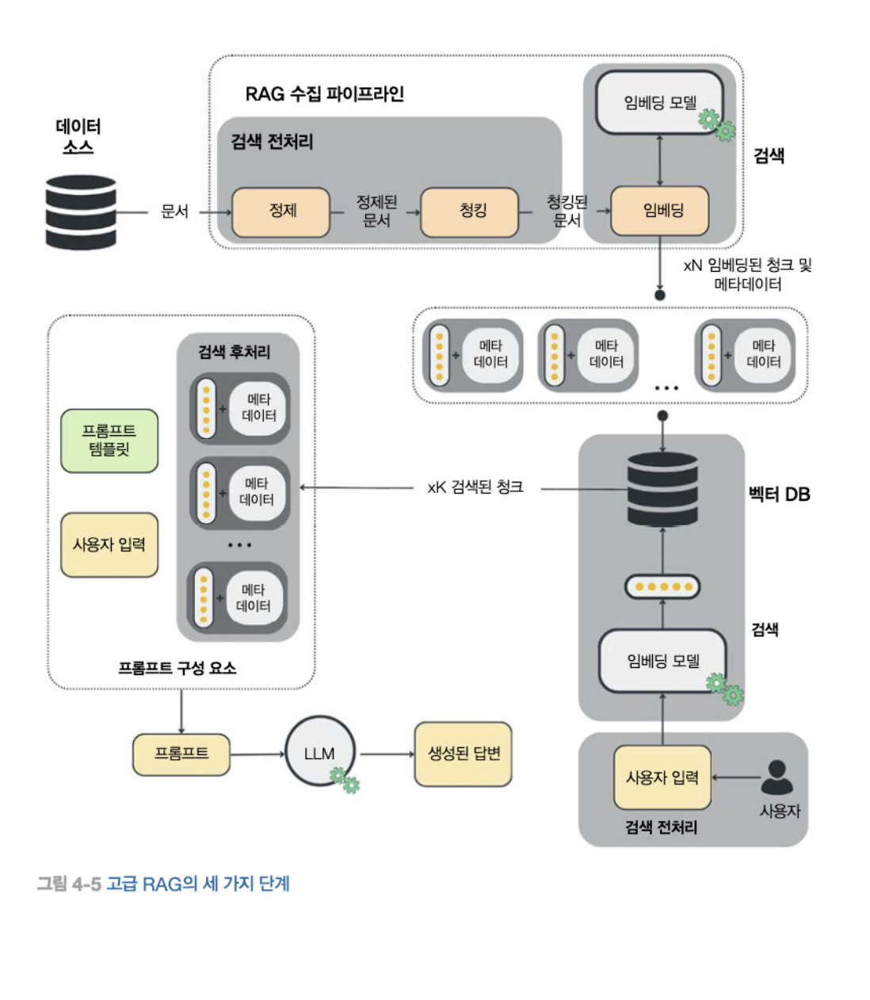
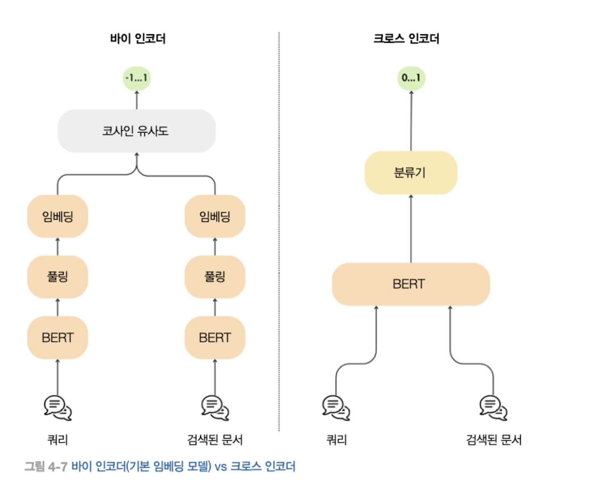

# 4. RAG 특성 파이프라인

검색 증강 생성
RAG의 핵심 역할은 LLM에 학습되지 않은 외부 데이터를 추가로 입력해 특정 작업(요약, 재구성, 데이터 추출)을 수행하는 것

단순한 RAG 구성요소
- 청킹
- 임베딩
- 백터 디비

고급 RAG 시스템
LLM Twin

## 4.1 RAG의 이해

RAG는 외부 정보를 활용해 LLM의 기존 지식을 보완하고, 보완된 지식을 바탕으로 LLM의 결괏값에 대한 정확도와 신뢰도를 높인다.

RAG의 주요 개념
- 검색: 관련 데이터를 검색
- 증강: 데이터를 프롬프트의 맥락으로 추가
- 생성: 증강된 프롬프트를 사용해 LLM이 답변을 생성

### 4.1.1 RAG 사용 이유

RAG 프로세스
1. 사용자 질문에 필요한 정보를 프롬프트에 주입
2. 증강된 프롬프트를 LLM에 전달하여 답변 생성
3. LLM은 추가된 맥락을 활용해 질문에 정확하게 대답

RAG는 아래와 같은 문제 해결을 목표로 한다.

#### 환격 현상
RAG를 활용하면 할루시네이션 제어 가능.
RAG 데이터를 이용해 생성한 대답이 실제 데이터에 기반하는지 검증

#### 오래된 정보

모든 LLM은 세계에 존재하는 일부 지식에 대해서만 학습하거나 파인튜닝 된다. 이는 아래와 같은 문제 때문이다.
- 프라이빗 데이터: 소유권이 없는 데이터는 학습시킬 수 없다.
- 새로운 데이터: 매순간 생성되는 새로운 데이터를 바로 학습할 수 없다.
- 비용: LLM 학습 및 파인튜닝은 비용이 많이 든다. (주기적 학습 불가)

### 4.1.2 기본 RAG 프레임워크

기본 RAG 프레임워크
- 수집 파이프라인: 배치 또는 스트리밍 방식으로 백터 DB를 채우는 파이프라인
- 검색 파이프라인: 백터 DB 검색을 통해 사용자의 입력과 관련된 항목을 검색하는 파이프라인
- 생성 파이프라인: 검색된 데이터를 사용해 프롬프트를 증강하고 LLM을 통해 답변을 생성하는 파이프라인

1. 백엔드 측에서 수집 파이프라인이 일정에 따라 또는 지속적으로 실행되어 외부 데이터를 백터 DB에 축적한다.
2. 클라이언트 측에서 사용자가 질문한다.
3. 질문은 파이프라인으로 전달되어 사용자의 입력을 전처리하고 백터DB를 검색한다.
4. 생성 파이프라인은 프롬프트 템플릿, 사용자 입력 검색된 문맥을 사용해 프롬프트를 생성한다.
5. 생성된 프롬프트는 LLM에 전달되어 답변을 생성한다.
6. 생성된 답변은 사용자에게 표시된다.

#### 수집 파이프라인

RAG 수집 파이프라인 구성
- 데이터 추출 모듈: DB, API, 웹 페이지 등 다양한 소스에서 필요한 데이터 수집
- 정제 모듈: 추출된 데이터를 표준화하고 불필요한 문자를 제거.
- 청킹 모듈: 정제된 문서를 작은 단위로 분할한다. 문서 내용을 임베딩 모델에 전달하려면 모델의 입력 최대 크기를 초과하지 않도록 하기 위해 분할이 필요하다. 또한 의미적으로 관련된 특정 영역을 분리하는 데 필요하다.
- 임베딩 모듈: 임베딩 모델을 사용해 청크의 내용을 받아 의미를 반영한 밀집 벡터로 변환한다.
- 로딩 모듈: 임베딩된 청크와 메타데이터 문서를 함꼐 처리한다. 임베딩은 유사한 청크를 쿼리하기 위한 인덱스로 사용되며 메타데이터는 프롬프트를 보강하는데 필요한 정보를 제공한다.

#### 검색 파이프라인

사용자의 입력을 받아 이를 임베딩 한 후, 백터 DB에서 사용자 입력과 유사한 벡터를 쿼리한다.
코사인 거리를 이용해서 처리한다.

#### 생성 파이프라인

사용자의 입력을 받아 데이터를 검색하고, 이를 LLM에 전달해 유용한 답변을 생성하는것.
최종 프롬프트는 시스템 프롬프트와 프롬프트 템플릿에 사용자의 질문과 검색된 문맥을 채워 넣어 생성된다.

### 4.1.3 임베딩이란?

다양한 개념을 숫자 코드로 변환하는 작업. 단, 비슷한 의미를 가진 단어나 항목들은 서로 가까운 코드로 변환한다. 변환된 데이터는 객체 간의 "의미론적 의미"와 "의미론적 관계"를 포착하는 데 도움을 준다.

#### 임베딩이 강력한 이유

임베딩은 범주형 변수를 인코딩하고 이를 머신러닝 모델에 입력할 수 있게 한다.
차원의 크기를 줄이고 의미를 모두 밀집된 백터에 압축할 수 있다.

#### 임베딩 기법

입력 데이터의 문맥과 의미를 파악하여 이를 연속적인 백터 공간에 투영하는 방식으로 임베딩을 생성한다.
- Sentence Transformers: 문장 임베딩 패키지 
- CLIP: 이미지 임베딩

#### 임베딩 사용

생성형 AI의 혁신과 함께 임베딩은 텍스트, 코드, 이미지, 오디오의 이미론적 검색 및 에이전트의 장기기억과 같은 검색 작업에서 많이 사용되고 있다.
- 범주형 변수 표현
- 추천 시스템
- 클ㄹ러스터링 및 이상치 탐지
- 데이터 시각화
- 분류 작업
- 제로샷 분류

### 4.1.4 백터 DB의 역할

스칼라 기반 DB는 백터 데이터의 복잡성을 처리하는 데 한계가 있어, 실시간 의미론적 검색과 같은 작업은 백터DB가 필수적이다.

#### 백터 DB 작동 방식

최근접 이운 탐색 (ANN) 알고리즘을 사용

백터 DB의 일반적인 프로세스
1. 백터 인덱싱
2. 유사도 검색
3. 결과 후처리

백터 DB는 벡터 검색 전이나 후에 메타데이터를 기반으로 필터링할 수 있다. 쿼리는 메타 데이터의 품질에도 영향을 받아서 관리가 되어야 한다.

#### 백터 인덱싱 알고리즘

벡터 DB 인덱싱 알고리즘
- 랜덤 프로덕션: 랜덤 프로젝션은 랜덤 행렬을 사용해 백터를 더 낮은 차원 공간으로 투영해 차원을 줄인다.
- 곱 양자화 (PQ): PQ는 백터를 더 작은 서브 벡터로 나눈 뒤, 이 서브벡터들을 대표 코드로 양자화 한다.
- 지역 민감 해싱 (LSH): 유사한 백터를 동일 버킷으로 해싱한다. 이 방법은 데이터의 일부에 초점을 맞추어 최근접 탐색을 빠르게 수행하여 계산 복잡성을 줄인다.
- 계층적 탐색 가능한 작은 세계 (HNSW): 각 노드가 벡터의 집합을 나타내는 다층 그래프를 구성한다. 유사한 노드들이 연결되며 알고리즘은 이 그래프를 탐색해서 최근접 이웃을 효율적으로 탐색한다.

#### 백터 DB 특징

백터 db는 프로덕션 환경의높은 성능과 관리 용이성을 보장하기 위해 아래와 같은특성을 가짐
- 샤딩과 복제: 데이터를 여러 노드에 분할해 확장성과 가용성 유지
- 모니터링: 성능 및 리소스 지표들을 모니터링하여 최적의 상태 유지
- 접근 제어: 허가된 사용자만 엑세스 할 수 있도록 한다
- 백업: 자동화된 백업 프로세스로 장애 및 유실에 대비

## 4.2 고급 RAG 개요

RAG 프레임워크의 품질과 관련된 요소
- 검색된 문서가 사용자의 질문과 관련이 있는가
- 검색된 문맥이 사용자의 질문에 답하기 충분한가
- 증강된 프롬프트에 불필요한 요소가 포함되어 있는가?
- 검색 소요 시간이 요구 사항을 충족하는가
- 검색된 정보를 사용해 유효한 답변을 생성할 수 없을 때는 어떻게 해야하는가

=> 품질 평가 모듈 + 고급 RAG 필요

고급 RAG에서 개선되는 포인트
- 검색 전처리: 데이터 인덱싱 최적화 + 쿼리 최적화
- 검색: 임베딩 모델과 메타데이터 필터링 개선
- 검색 후처리: 검색된 문서에서 노이즈를 제거하고 LLM에 답변 생성을 요청하기 전에 프롬프트를 압축하는 다양한 방법 적용

검색 전처리는 두 가지 방식으로 수행
- 데이터 인덱싱: RAG 파이프라인의 일부로, 주로 정제나 청킹 모듈에서 구현되어 데이터를 더 나은 인덱싱을 위해 전처리한다.
- 쿼리 최적화: 사용자의 쿼리를 임베딩하고 벡터 DB에서 검색하기 전에 알고리즘을 직접 적용하여 최적화한다.

#### 데이터 인덱싱 기법
- 슬라이딩 윈도우: 텍스트 청크의 일부를 겹치게 하여 청크의 경계에 위치한 문맥을 보존한다. 이는 법률 문서, 과학 논문, 고객 지원 로그, 의료 기록처럼 중요한 정보가 여러 섹션에 걸쳐 있는 도메인에서 검색 정확도를 높이는 데 유용하다. 임베딩은 청크와 겹치는 부분을 함께 계산하고, 이를 통해 관련성 있고 일관된 정보를 검색하는 시스템의 능력을 향상시킨다.
- 데이터 세분화 개선: 관련 없는 정보를 제거하고 사실 여부를 검증하며, 오래된 정보를 업데 이트하는 등의 기법을 포함한다. 개선된 데이터셋은 더 나은 검색 성능을 만든다.
- 메타데이터: 날짜, URL, 외부 ID, 챕터 마커chapter marker1'와 같은 메타데이터 태그를 추가하면 검색 시 결과를 효율적으로 필터링할 수 있다.
- 인덱싱 구조 최적화: 다양한 청크 크기, 다중 인덱싱 전략과 같은 다양한 데이터 인덱싱 방 법을 적용해 인덱스 구조를 최적화한다.
- small to big:  검색에 사용되는 청크와 최종 답변 생성을 위해 LLM에 입력되는 청크를 분리한다. 검색 에는 크기가 작은 청크를 사용한다. 문서를 작은 청크로 나눌때 청크 주변에 있는 청크들의 정보를 메타데이터 에 포함시킨다. 그리고 검색된 작은 청크가 답변 생성에 사용될 때에는 청크 주변에 있는 청크들도 함께 LLM 에 입력된다. 즉, 작은 청크로 검색 정확도를 향상시키고 큰 청크로 LLM에 더 풍부한 문맥 정보를 제공한다.
이 기법이 유효한 이유는 큰 텍스트 단위로 임베딩을 계산하면 너무 많은 노이즈나 여러 주제가 포함될 수 있 기 때문이다. 이는 임베딩의 의미적 표현 수준을 저하시킨다.

#### 쿼리 최적화 기법

- 쿼리 라우팅: : 사용자의 입력에 따라 서로 다른 데이터 카테고리와 상호작용해야 하며, 각 카테고리별 로 서로 다른 방식으로 쿼리를 수행할 수 있다. 쿼리 라우팅은 사용자의 입력을 기반으로 어떤 작업을 수행할 지 결정하는 데 사용되고, if/else 문과 유사하다. 그러나 이러한 결정은 if/else 와 같은 논리적 연산이 아닌 자연어만을 사용해 이루어진다. [그림 4-6]에서 설명한 것처럼. 사용자의 입력에 따라 RAG를 수행하기 위 해 추가적인 문맥을 벡터 검색 쿼리를 통해 벡터 DB에서 검색하거나, 사용자의 쿼리를 SQL 명령으로 변환해 표준 SQL DB에서 검색하거나, REST API 호출을 활용해 인터넷에서 검색할 수 있다. 쿼리 라우터는 문맥 이 필요한지 여부를 감지해 외부 데이터 저장소의 불필요한 호출을 줄여준다. 또한 쿼리 라우팅은 주어진 입력 에 적합한 프롬프트 템플릿을 선택하는 데 사용될 수 있다. 예를 들어, LLM Twin 사용 사례에서 사용자가 기사 단락, 게시물, 코드 조각 중 무엇을 원하는지에 따라 생성 과정을 최적화하기 위해 서로 다른 프롬프트 템플릿이 필요하다. 라우팅은 일반적으로 LLM을 사용해 어떤 경로를 선택할지 결정하거나, 가장 유사한 벡터를 가진 경로를 선택하도록 임베딩을 사용한다. 요약하면, 쿼리 라우팅은 if/else 문과 동일한 개념이지만 자연어를 직접 처리하기 때문에 더 유연하게 동작.
- 쿼리 재작성 query rewrting : 이 기법은 사용자가 입력한 쿼리가 실제 데이터 구조와 잘 맞지 않을 때 활용된다. 이 는 질문을 다시 다듬어 인덱싱된 정보와 더 잘 부합하도록 재구성하는 과정으로, 다음과 같은 기법들을 사용 한다.
    - 의역paraphasing: 사용자 질문의 의미를 유지하면서 표현을 바꾼다. 예를 들어, What are the causes of climate change?'를 Factors contributing to global warming'으로 재작성한다.
    - 동의어 대체synonym substuton : 검색 범위를 넓히기 위해 다소 특수한 단어를 보편적인 동의어로 교체한다. 예 를 들어, joyful'을 더 일반적인 표현인 happy'로 바꾸는 것이다.
    - 하위 쿼리aub-quay: 긴 질문을 더 짧고 명확한 여러 개의 하위 질문으로 나누면, 검색 과정에서 관련 문서를 더 정확하게 찾을 수 있다.
- 가상 문서 임베딩™potheical document ambedding (HyDE): 이 기법은 LLM을 활용해 주어진 질문에 대한 가상의 답 변을 먼저 생성하고, 이 답변과 원본 질문을 함께 검색 과정의 입력으로 사용하는 방식이다.
- 쿼리 확장query expansion : 사용자의 질문에 추가적인 용어나 개념을 추가해 원본 질문의 다양한 관점을 반영하도 록 풍부하게 만든다. 예를 들어, 'disease'를 검색할 때 원본 쿼리 단어와 관련된 동의어와 연관 용어를 활용해 inesses'나 ailments'를 함께 포함할 수 있다.
- 셀프 쿼리sof-quary : 비정형의 자연어 질문에서 구조적인 검색 쿼리를 추출하는 기법이다. LLM이 입력 텍스트 에서 주요 엔티티, 이벤트, 관계 등을 파악한다. 이렇게 파악된 요소들을 필터링 매개변수로 활용해 벡터 검색 범위를 좁힐 수 있다. 예를 들어, 쿼리에서 'Paris'와 같은 도시명을 인식하고 이를 필터로 사용하면 벡터 검색 범위를 효과적으로 축소할 수 있다.

### 4.2.2 검색

검색은 다음 두 가지 방법으로 최적화가 가능하다
- 임베딩 모델 개선
- 데이터 베이스의 필터 및 검색 기능 활용

쿼리와 인덱싱된 데이터 간의 유사도를 활용하여 검색 성능을 향상시킨다.
파인 튜닝 대신 instructor 모델을 활용할 수 있다.

- 하이브리드 검색: 벡터 검색 + 키워드 검색 결합
- 필터링된 백터 검색: 메타데이터 인덱스를 활용해 메타데이터 내 특정 키워드를 필터링

벡터 검색이나 하이브리드 검색을 임베딩 모델 개선보다 먼저 적용한다.

### 4.2.3 검색 후처리

#### 검색 후처리 

검색된 데이터를 가공하거나 재구성하는 프로세스이다.

문맥 크기의 제한이나 불필요한 정보로 인해 LLM의 성능 저하를 막는다.

- 프롬프트 압축: 핵심 유지 + 불필요한 정보 제거
- 리랭킹: 크로스 인코더 모델을 사용해 사용자 입력과 검색된 각 청크 간의 유사도 점수를 다시 계산한다.

## 4.3 LLM Twin의 RAG 특성 파이프라인 아키텍쳐

RAG 시스템은 두 개의 요소로 나눌 수 있다.
- 수집 파이프라인: 원시 데이터를 입력 받아 이를 정제하고 청크로 분할한 뒤, 임베딩으로 변환해 백터 DB에 저장한다.
- 추론(검색+생성) 파이프라인: 백터 DB에서 관련 있는 문맥을 쿼리하고, 이를 활용해 LLM을 통해 최종적으로 답변을 생성한다.

### 4.3.1 문제 정의

### 4.3.2 특성 저장소

RAG - 특성 파이프라인의 한 요소

특성 파이프라인: 원시 데이터를 입력받아 특성과 레이블을 생성해 특성 저장소에 저장한다.
특성은 문자열이 아닌 토큰화된 데이터여야 한다.

### 4.3.3 원시 데이터의 수집 경로

ETL 파이프라인 -> 데이터 웨어하우스

### 4.3.4 RAG 특성 파이프라인의 아키텍처 설계

배치 vs 스트리밍

#### 배치 파이프라인

배치 파이프라인의 작업
- 데이터 수집
- 예약처리
- 데이터 적재

배치 파이프라인의 이점
- 효율성: 대량의 데이터를 효율적으로 병렬처리 할 수 있다.
- 복잡한 처리: 실시간 처리로는 리소스 소모가 너무 심한 복잡한 데이터의 작업을 가능하게 한다.
- 단순성: 실시간 시스템보다 구현, 유지, 관리가 편하다

일반적으로
- 즉각적인 데이터 처리가 필요하지 않음
- 단순성
의 이점으로 초기 시스템은 배치 아키텍처를 우선 고려한다.

#### 다섯 가지 핵심 단계

- 데이터 추출
- 정제
- 청킹
- 임베딩
- 데이터 적제

#### 데이터 변경 감지: 데이터 웨어하우스와 특성 저장소 동기화

CDC 패턴
- push
- pull
구현 방식
- timestamp 기반
- log 기반
- 트리거 기반

두 가지 스냅샷 데이터가 저장되는 이유
- 데이터가 정재된 후: LLM 파인 튜닝 용
- 문서가 청킹되고 임베딩 된 후: RAG용

#### 오케스트레이션

ZenML
- 스케줄링
- 수동 실행
- ETL 완료 후. 트리거

## 4.4 LLM Twin의 RAG 특성 파이프라인 구현하기

### 4.4.1 설정

### 4.4.2 파이프라인과 스탭

#### 데이터 웨어하우스 쿼리
#### 문서 정제
#### 정제 문서의 청킹과 임베딩
#### 벡터DB 저장

### 4.4.3 Pydantic 도메인 엔티티

#### OVM

### 4.4.4 dispatch 계층

문서를 입력받아 해당 문서의 데이터 범주에 따라 전용 핸들러를 적용한다.
핸들러는 문서를 정제하고 분할하며 임베딩하는 작업을 수행할 수 있다.

