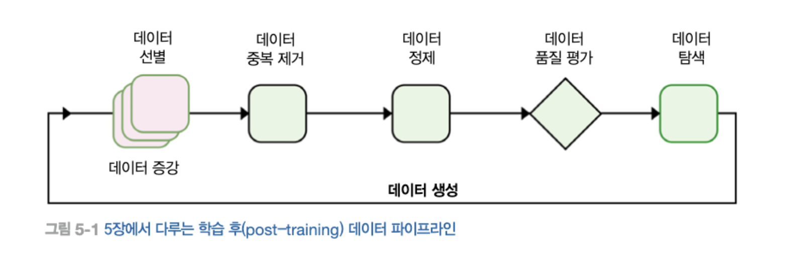

# 5. 지도 학습 파인 튜닝

지도 학습 파인 튜닝

## 5.1 지시문 데이터셋 생성

원시 텍스트를 지시문 - 답변의 형태로 변환햐애 한다.

### 5.1.1 일반적인 프레임워크

파인 튜닝 과정에서
1. 답변만 학습
2. 지시문과 답변 모두 학습
하게 할 수 있다.

#### 데이터 품질

- 작업 특화 모델
- 도메인 특화 모델

도메인 특화 파인튜닝에 필요한 데이터양은 도메인의 복잡성과 범위에 따라 달라진다.
도메인 특화 모델을 위한 데이터의 요구사항은
- 해당 분야의 규모
- 사전 학습 데이터에 데이터가 얼마나 반영되어 있었는지

### 5.1.2 데이터 선별

작업 특화 모델: 작업의 예제에 따라 지시문 데이터셋 생성
도메인 특화 모델: 관련 텍스트, 연구 논문, 기술문서 및. 기타 도메인 특화 콘틴츠 수집 및 검증 필요

### 5.1.3 규칙 기반 필터링

- 규칙 기반 필터링: 사전에 정의된 규칙을 사용해 데이터 샘플을 평가
- 길이 기반 필터링: 응답 허용 가능 길이의 임계값을 포함해 너무 길거나 짧은 데이터 제외
- 키워드 제외: 저품질 또는 부적절한 콘텐츠 키워드 제외
- 형식 검사: 구조화된 데이터를 포함하거나 특정 형식 요구 사항을 따르는 데이터셋에 권장된다. ex) 코드가 답변에 포함될 경우, 코드가 올바른지 확인

### 5.1.4 데이터 중복 제거

데이터셋에 중복되거나 비슷한 데이터가 많으면 발생 가능한 문제
- 오버피팅
- 편향된 성능
- 비효율적인 학습: 새로운 데이터 없이 학습 시간만 는다.
- 과대 평가된 평가지표: 테스트 데이터셋의 중복 데이터 떄문에 성능 추정치가 낙관적일 수 있다.

중복 제거 방법
- 정확 중복 제거: 정규화, 해시생성, 중복 제거 과정을 통해 같은 데이터 제거
- 퍼지 중복 제거
    - MinHash 중복 제거: 데이터 항목을 간결한 표현 또는 서명을 생성해 작동
- 의미론적 유사도: 임베딩 모델을 통한 유사도 생성

### 5.1.5 데이터 정제

데이터 정제는 학습 데이터셋에 평가나 테스트셋과 동일하거나 매우 유사한 샘플이 포함되지 않도록 선별하는 과정. 중복 제거 기법을 활용한다.

### 5.1.6 데이터 품질 평가

데이터셋의 정확성, 다양성, 복잡성 등 여러 특성을 종합적으로 평가
LLM을 평가자로 사용하기도 한다.

편향을 줄이기 위해
- 여러 LLM을 배심원으로 사용
- 답변 A와 B를 무작위로 섞음 (첫 답변을 더 선호하는 경향이 있음)

### 5.1.7 데이터 탐색

학습 데이터를 파악하고 이해하는 데 필요한 과정
데이터셋의 특성, 강점, 잠재적인 한계를 이해하는데 중요한 역할을 하는 수작업 검사와 자동 분석을 모두 포함한다.

- 수작업 데이터셋 탐색
효율성을 높인 방법
    - 계층적 샘플링 (다양한 샘플 선택)
    - 체계적 검토 (체크리스트를 활용한 검토)
    - 협력적 검토 (리뷰어 참여)

- 통계 분석: 어휘 다양성, 잠재적 편향, 개념 표현 등을 분석
- 토픽 클러스터링: 유사한 문서나 텍스트 조각을 자동으로 그룹화해서 데이터 내의 숨겨진 주제와 패턴을 드러낸다.

### 5.1.8 데이터 생성

지시문이 충분하지 않을 경우 합성 데이터 생성을 사용할 수 있다.

### 5.1.9 데이터 증강

- 데이터 샘플의 양과 질을 향상시키는 과정
- 심화 발전: 기존 명령의 복잡성을 향상
    - 제약 조건
    - 심화
    - 구체화
    - 추론 단계 증가
- 확장 발전

UltraFeedback 방법: 답변의 품질 개선에 중접을 둔 접근법

## 5.2 지시문 데이터셋 자체 생성

## 5.3 SFT 기법

지시문 - 답변 쌍으로 구성된 소규모 데이터셋을 사용해 사전 학습된 모델을 다시 학습 시키는 과정

### 5.3.1 파인튜닝이 필요한 경우

퓨-샷 프롬프팅이나 검색 증강 생성(RAG) 같은 기법을 활용하면 SFT 없이도 효과적으로  여러 문제를 해결 할 수 있다.

### 5.3.2 지시문 데이터셋 형식

### 5.3.3 챗 템플릿

데이터셋 형식에서 지시문-답변 쌍을 추출한 후 이를 챗 템플릿으로 구조화한다.
챗 템플릿은 모델에 지시문-답변을 제시하는 통일된 방식을 제공한다.

### 5.3.4 파라미터 효율적인 파인튜닝 기법

- 전체 파인 튜닝: 가장 단순한 SFT 기법. 상당한 계산 자원 요구. 
- LoRA: LLM을 파인튜닝하기 위해 설계된 효율적인 기법 중 하나
    - 학습 간으한 저차원의 저랭크 행렬을 도입해, 모델의 원래 파라미터를 변경하지 않고도 동작 조정 가능
        - 학습 중 메모리 사용량 대폭 감소
        - 더 빠른 파인튜닝
        - 사전 학습된 모델 가중치 보존
        - LoRA 가중치를 교체해 작업간 효율적으로 전환 가능
- QLoRA: 높은 계산 비용 문제 해결. 양자화 + LoRA

### 5.3.5 학습 파라미터

#### 학습률과 스케줄러

학습 과정에서 모델의 파라미터가 얼마나 업데이트 될 지

#### 배치 크기

모델의 가중치가 업데이트되기 전에 처리되는 데이터 샘플의 수

#### 최대 길이와 패킹

모델이 처리할 수 있는 가장 긴 입력의 길이를 결정

#### epoch 수

전체 학습 데이터셋을 완전히 통과하는 횟수

#### 옵티마이저

손실 함수를 최소화 하기 위해 모델의 파라미터를 조정한다.

#### 가중치 감소

손실 함수에 큰 가중치에 패널티를 부과해 모델이 더 단순하고 일반화된 특성을 학습하도록 한다.

#### 그레디언트 체크포인팅

순방향 연산에서 생성된 중간 활성화 값 중 일부만 메모리에 저장해 학습 중 메모리 소비를 줄이는 기술

모니터링에 중요한 지표
- 학습 손실: 모델이 학습 중인 작업을 얼마나 잘 수행하는지 측정
- 검증 손실학습 데이터가 아닌 검증 데이터를 사용해 손실을 ㅊ ㅡㄱ정. 잘 학습된 모델은 학습 손실과 검증 손실이 모두 감소하다가 결국 안정화 되며 두 값사이 차이가 적다.
- 그레디언트 노름: 그레디언트 백터의 크기

