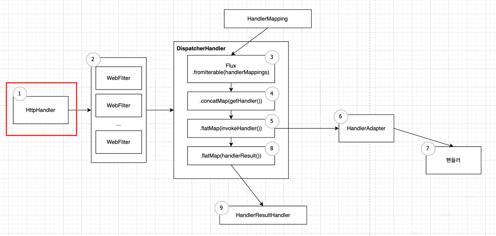

# Spring WebFlux 개요

## 15.1 SpringWebFlux의 탄생 배경

Spring WebFlux는 리액티브 웹 애플리케이션 구현을 위해 Spring5.0부터 지원하는 리액티브 웹 프레임워크


## 15.2 Spring WebFlux의 기술 스택

### 서버

||Servlet Stack| ReactiveStack |
|---|----------|---------------|
|서버| Servlet Container (Blocking IO) | Netty (NonBlockingIO) |
|서버 API|서블릿 API|리액티브 스트림즈 어뎁터|
|보안|Spring Security|WebFilter|
|데이터 엑세스|Spring Data JDBC / DATA JPA|Data R2DBC, NOSQL|

## 15.3 Spring WebFlux의 요청 처리 흐름



1. 최초 클라이언트로부터 요청이 들어오면 Netty 등의 서버 엔진을 거쳐 HttpHandler가 들어오는 요청을 전달받는다. HttpHandler는 여러 서버 엔진에서 지원하는 서버 api를 사용할 수 있도록 서버 api를 추상화 해준다. 각 서버 엔진마다 주어지는 ServerHttpRequest와 ServerHttpResponse를 포함하는 ServerWebExcahgne를 생성한 후, WebFilter 체인으로 전달한다.

2. ServerWebExcahgne는 WebFilter 체인에서 전처리 과정을 거친 후 WebHandler 인터페이스의 구현체인 DispatcherHandler 에게 전달된다.

3. Spring MVC의 DispatcherServlet과 유사한 역할을 하는 DispatcherHandler에서는 HandlerMapping List를 원본 Flux의 소스로 전달받는다.

4. ServerWebExchange를 처리할 핸들러를 조회한다.

5. 조회한 핸들러의 호출을 HandlerAdapter에게 위임한다.

6. HandlerAdapter는 ServerWebExcahgne를 처리할 핸들러를 호출한다.

7. Controller 또는 HnadlerFunction 형태의 핸들러에서 요청을 처리한 후, 응답 데이터를 리턴한다.

8. 핸들러로부터 리턴받은 응답 데이터를 처리할 HandlerResultHandler를 조회한다.

9. 조회한 HandlerResultHandler가 응답 데이터를 적절하게 처리한 후, response로 리턴한다.


## 15.4 Spring WebFlux의 핵심 컴포넌트

- HttpHandler

 다른 유형의 Http 서버 API로 request와 response를 처리하기 위해 추상화된 단 하나의 메서드만 가진다.


```
public interface HttpHandler {
  Mono<Void> handle(ServletHttpRequest request, ServletHttpResponse response);
}
```

- WebFilter

Web MVC의 서블릿 필터 처럼 핸들러가 요청을 처리하기 전에 전처리 작업을 수행할 수 있도록 해준다.
보안이나 세션 타임아웃 처리 등 애플리케이션에서 공통으로 필요한 전처리에 사용된다. spring의 bean으로 등록이 된다.
```
public interface WebFilter {
  Mono<Void> filter(ServerWebExchage exchange, WebFilterChain chain);
}
```

- HandlerFilterFunction

HandlerFilterFunction은 함수형 기반의 요청 핸들러에 적용할 수 있는 Filter다. bean으로 등록되지는 않는다. 함수형 기반의 핸들러에서만 제한적으로 필터링 작업이 가능하다.
```
@FunctionalInterface
public interface HandlerFilterFunction<T extends ServerResponse, R extends ServerResponse>() {
  Mono<R> filter(ServerRequest request, HandlerFunction<T> next);
}
```

- DispatcherHandler

 WebHandler 인터페이스의 구현체로서 Spring MVC의 FrontController 패턴이 적용된 DispatcherServlet처럼 중앙선에서 먼저 요청을 전달받은 후에 다른 컴포넌트에 요청 처리를 위임한다.  
  DispatcherHandler 자체가 Spring Bean으로 등록되도록 설계되었으며, ApplicationContext에서 HandlerMapping, HandlerAdapter, HandlerResultHandler 등의 요청 처리를 위한 위임 컴포넌트를 검색한다.

> 1. initStrategies(AppicationContext context)
> BeanFactoryUtils를 이용해 ApplicationContext로 부터 HandlerMapping Bean, HandlerAdapter Bean HandlerResultHadler Bean을 검색한 후에 각각 List< HandlerMapping >, List< HandlerAdapter >, List< HandlerResultHadler > 객체를 생성한다.

> 2. handle(ServerWebExchange exchange)
>> 2-1. handle(ServerWEbExchange exchange)는 List< HandlerMapping >을 Flux.fromIterable() Operator의 원본 데이터 소스로 입력받은 후에 getHandler()메서드를 통해 매치되는 Handler 중에서 첫 번째 핸들러를 사용한다.

>> 2-2. invokeHandler(ServerWebExchange exchange, Object handler)를 통해 핸들러 호출을 위임한다. 실제 핸들러 호출은 invokeHandler() 내부에서 Handler 객체와 매핑되는 HandlerAdapter를 통해서 이루어진다.

>> 2-3. handlerResult(ServerWebExchange exchange, HandlerResult result) 를 통해 응답 처리를 위임한다.  실제 응답 처리는 handler() 내부에서 호출한 getResultHandler에서 HandlerResult 객체와 매핑되는 HandlerResultHandler를 통해서 이루어진다.

- HandlerMapping

 HandlerMapping은 Spring MVC와 마찬가지로 request와 handler object에 대한 매핑을 정의하는 인터페이스이다. RequestMappingHandlerMapping, RouterFunctionMapping 등이 HandlerMapping 인터페이스를 구현한다.

 - HandlerAdapter

  HandlerMapping을 통해 얻능 핸들러를 직접적으로 호출하는 역할
  RequestMappingHandlerAdpater, HandlerFunctionAdapter, SimpleHandlerAdapter, WebSocketHandlerAdapter등이 이를 구현한다.
  
  ```
  public interface Handler {
    boolean supports(Object handler); //지원하는지 체크
    Mono<HandlerResult> handle(ServerWebExchange exchange, Object handler); //handler 호출
  }
  ```

## 15.5 Spring WebFlux의 Non-Blocking 프로세스 구조

 Spring MVC와는 달리 Non-Blocking I/O 방식으로 동작해 쓰레드가 차단되지 않기 떄문에 적은 수의 고정된 스레드 풀을 사용해서 더 많은 요청을 처리한다. 이를 위해 이벤트 루프 방식을 사용한다.

 > 1. 클라이언트로 부터 들어오는 요청을 요청 핸들러가 전달받는다.
 > 2. 전달받은 요청을 이벤트 루프에 푸시한다.
 > 3. 이벤트 루프는 네트워크, 데이터베이스 연결 등 작업 비용이 드는 작업에 대한 콜백을 등록한다.
 > 4. 작업이 완료되면 완료 이벤트를 이벤트 루프에 푸시한다.
 > 5. 등록한 콜백을 호출해 처리 결과를 전달한다.


 15.6 Spring WebFlux의 스레드 모델

  Spring WebFLux는 Non-Blocking I/O를 지원하는 Netty등의 서버 엔진에서 적은 수의 고정된 크기의 스레드(일반적으로 CPU 코어 개수만큼 스레드 생성)를 생성해서 대량의 요청을 처리

   이 떄문에 Blocking되는 지점이 존재한다면 성능 저하가 일어날 수 있다. 이러한 성능 저하를 보완하고자 클라이언트의 요청을 처리하기 위해 서버 엔진에서 제공하는 스레드 풀이 아닌 다른 스레드 풀을 사용할 수 있는 메커니즘을 제공하는데, 이것이 바로 '스케줄러'이다.   


