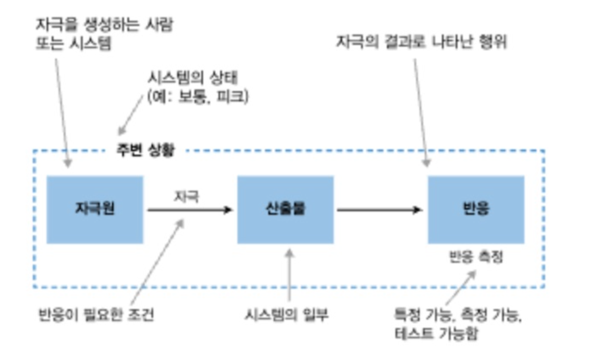
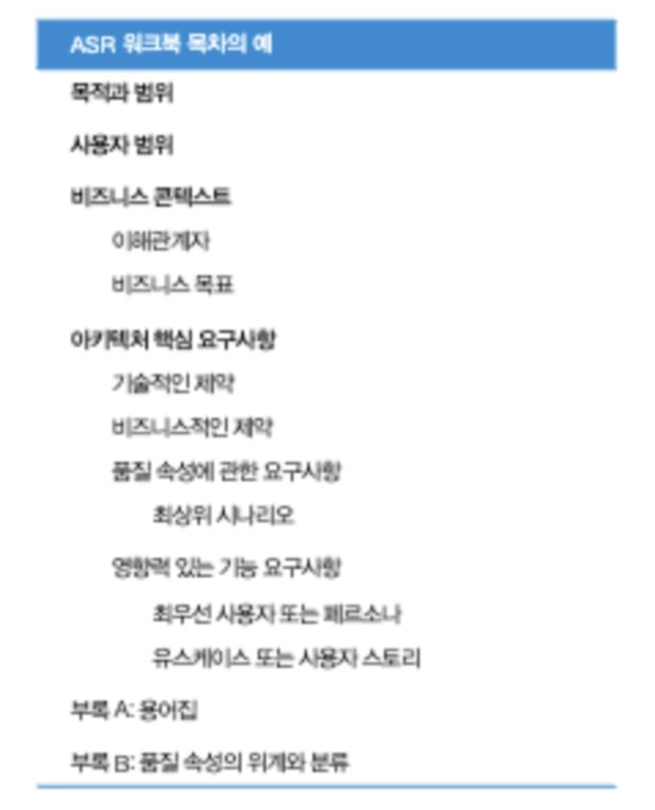

# 5 아키텍처 핵심 요구사항 알아내기

**아키텍처 핵심 요구사항**

아키텍처를 선택하거나 구성할 때 큰 영향을 미치는 요구사항을 말합니다.
1. 제약: 바꿀 수 없는 결정사항
2. 품질속성: 시스템을 다른 시스템과 구분짓는 요소
3. 영향력있 기능 요구사항: 아키텍처에서 특별히 주목해야 하는 기능
4. 기타: 시간, 지식, 경험, 능력, 내부 규정

## 5.1 제약으로 설계 선택지 졸이기

제약은 이미 정해져서 변경이 불가능한 설계상의 의사결정을 의미합니다.
잘 설계된 제약은 문제를 단순화 시킬 수 있다.

제약은 기술 또는 비즈니스에 영향을 미칠 수도 있다. 
ex) 스타트업에서 왜 node.js와 같은 runtime을 선호하는지. -> 빠른 생산성.

### 5.1.1 제약 단순화 하기

제약을 파악하려면 간단한 문장으로 설계결정과 그 주체를 설명한다.

일단 결정된 제약은 협상할 수도 없고 돌이킬 수 없다고 못는다. 그렇게 하되, 제약을 받아들일 때는 보수적이여야 한다. (못바꾸니까...)

소프트웨어 시스템에서 설계 결정은 제약처럼 변질되기도 한다.

## 5.2 품질속성 정의하기

품질속성은 소프트웨어시스템의 외부에서 볼 수 있는 특성과 그 시스템에 기대하는 동작이 무엇인지를 설명한다. 품질 속성은 시스템이 어떤 작업을 얼마나 잘수행해야하는지를 정의한다. 이들은 시스템의 '~성(효율성등)' 으로 표현되기에 품질 요구사항이라고도 한다.

| 설계 시점의 요소	| 실행 시점의 요소 | 추상적인 요소 |
|---	|---	|---	|
| 변경 가능성 | 가용성 | 관리용이성 |
| 유지 보수성 | 신뢰성 | 정비성	|
| 재사용성	| 성능 | 단순성	|
| 테스트 가능성 | 확장성 | 교육 편의성	|
| 구축 편의성 | 보안 | 	|

아키텍처에 관한 결정이 이루어지면 품질속성 증 하나쯤은 꼭 촉진되거나 억제된다.
이 경우 아키텍처에 좀더 어울리는 품질속성을 선택하고 다른 품질속성의 가치를 줄일 수 밖에 없다.

품질속성은 비기능 요구사항이다.
품질속성은 절충이나 맞교환하는 성질이다.

### 5.2.1 품질 속성을 시나리오로 만들기

**품질속성 시나리오**를 만들어 품질 속성에 의미를 부여한다.

품질속성시나리오는 특정 상황에서 소프트웨어시스템이 동작하는 방식을 설명한다.

1. 자극: 시스템이 어떤 식으로든 반응하도록 요구하는 일종의 이벤트
2. 자극원: 자극을 발생시키는 하람이나 시스템 (사용자, 시스템 컴포넌트, 외부 시스템)
3. 산출물: 시나리오를 특정할 수 있게 하는 시스템의 한 부분
4. 반응: 자극 때문에 시스템 외부로 산출물을 드러내는 동작. 자극이 반응을 만든다.
5. 반응 측정: 시나리오가 성공했을 경우 반응이 어떠할지를 기준으로 성공의 기준을 정한다. 반응 측정은 구체적이고 측정가능해야 한다.
6. 주변 상황: 시나리오를 실행하는 동안 시스템이 놓인 실행환경을 의미. 주변 환경이 '이상 없음' 이라고 할지라도 항상 기록해야 한다. (트래픽이 최고로 몰려 있는 상황)

모든 항목들을 다 정의할 필요는 없다. 자극, 자극원, 반응, 반응 측정 정도만 정의한다. 실행환경이 특수하면 주변 상황을 추가하기도 한다.

ex)
- 가용성: RFP 데이터베이스가 반응하지 않으면 라이언하트는 실패로그를 기록하고 3초내로 예전정보로 응답한다.

### 5.2.2 측정 가능하고 명료하게 기술하는 방법

 반응 측정을 작성하기 위해 먼저 자신의 경험에 따라 잠재적 값을 추정해본다. 다양한 상황을 가정하여 이해관계자들의 반응을 확인해가며 대응책을 찾는다. 측정하기 좋을수록 테스트하기 좋다. 테스트가 불가능하면 명료하거나 측정 가능하지 않다는 의미이다.

## 5.3 기능 요구사항 찾아내기

**영향력 있는 기능 요구사항**
아키텍처의 의사결정을 주도할 정도로 중요한 기능 요구 사항

영향력 있는 기능 요구사항을 알아내는 방법
1. 먼저 현재의 생각을 요약한 추상적인 수준의 아키텍처를 간단히 작성한다.
2. 비슷한 문제끼리 묶은 후 일반적인 요구사항을 분류한다.
3. 앞서 작성해본 아키텍처로 해결 가능한지 분류별로 살펴본다. 만약 요구사항이 모호하고 해결 방법도 즉시 떠오르지 않는다면, 그 요구사항은 아키텍처에 중요한 영향력을 미칠 가능성이 높다.

아주 긴 요구사항 목록을 적게 줄인다.
- 하나의 아키텍처 요소로 구현할 수 있는 공통적인 요구사항을 파악한다. (데이터 불변성, 사용자 인터렉션 끼리 묶는다) 
- 구현하기 어려운 요구사항을 찾아본다. 이런 요구사항들이 아키텍처에 종요한 영향을 미친다.
- 가치가 높고 우선순위도 높은 기능요구사항을 파악한다.

ex) 

## 5.4 아키텍처에 영향을 미치는 다른 요소 찾아내기

 아키텍트로서의 능력과 경험, 팀의 능력 등...

## 5.5 콘웨이 법칙

조직 구조와 아키텍처: 협업하는 사람의 수 만큼 컴포넌트가 만들어진다.

## 5.6 필요한 정보에 깊이 들어가기

**아키텍처 핵심 요구사항(ASR)**

제품 백로그, 이해관계자와의 대화 등을 통해 AS을 파악한다.

## 5.7 ASR 워크북 만들기

ASR이 나올떄 마다 노트에 기록한다. (ASR 워크북)
초기에는 아키텍처가 갱신되며 ASR이 빠르게 갱신되지만, 많은 사항이 정해지고 나면 참고용으로 사용이 될 수 있다.

#### 능동적으로 듣는 법

이해 관계자의 목표를 이해하는 일
능동적으로 듣는 것이 가장 쓸모있는 커뮤니케이션 기술이다. 
능동적 듣기를 통해 상대방의 말을 듣고 이해해야 한다.
문화나 맥락 등을 공감하고, 더 잘 이해하기 위해서 질문해야 한다.
