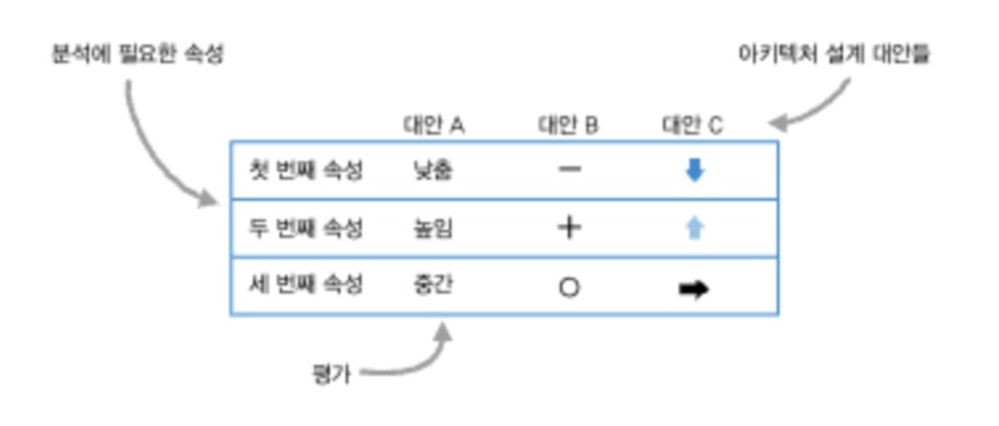
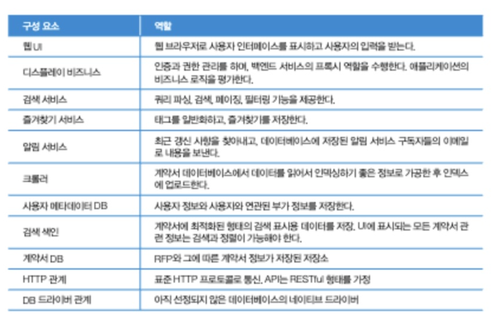

# 6. 아키텍처 선택하기

소프트웨어 아키텍처 설계란 불확실함 속에서 의사결정을 내리는 일이다.
이 과정에서 절충과 타협을 거치며 요구사항을 충족, 비즈니스 목표를 달성해 간다.

## 6.1 대안을 위한 분기, 결정을 위한 통합

 설계를 위한 탐색은 분기와 융합을 반복하는 여정이다. 
 - 분기: 여러 대안 탐색
 - 통합: 적절한 아키텍처 선택
 품질속성, 구조, 그리고 이에영향을 미치는 설계에 집중해야 한다.

### 6.1.1 설계에 중요한 사항을 찾아내기

아키텍트는 설계시 중요한 의사결정을 주도적으로 파악해야하고, 소프트웨어 구성을 적극적으로 선택해서 품질속성을 원하는 수준까지 올려야 한다.

통상적인 소프트웨어 시스템 설계에서 아키텍트가 파악해야 하는 것
- 아키텍처에서 구조를 어떻게 조합할지 결정하기 위한 각 구성 요소와 그 역할
- 구성요소간의 상호작용 방식을 결정하기위한 관계와 인터페이스
- 아키텍처가 보델로 삼은 세상을 이해하기 위한 도메인
- 품질 속성을 끌어올리기 위한 기술과 프레임워크
- 아키텍처를 온전히 릴리스 하기 위한 설치와 배포 방법
- 과거의 설계에서 얻은 관점과 의사결정 과정
설계상의 의사결정과 이해관계자의 요구사항 사이를 명료하게 연결할 수 있으면 좋다.

배포를 과소평가하지 마라.
롤링 업데이트, 레드그린 업데이트
- 호환성 유지 정책 강요
- 기능을 on/off 시키는 토글
- 처리 못하는 응답 암묵적으로 무시

## 6.2 제약 수용하기

이미 결정되어 바꿀 수 없는 사항

제약은 아키텍처에 심대한 영향을 미치지만 그럼에도 제약을 받아들이고 아키텍처의 의사결정은 품질 속성을 올리는 데에 초점을 맞춰야한다.

## 6.3 품질 속성 끌어올리기

아키텍트는 소프트웨어 시스템에서 품질속성을 더 촉진할 수 있는 구조를 선택해야한다.
구조를 선택하는 가장 일반적인 방법은 패턴을 탐색하는 것이다. (기존 패턴 중 적합한걸 선택하는 것을 우선하자.)

### 6.3.1 품질 속성을 염두에 두고 패턴 찾기

- pub/sub
- service oriented (MSA의 서비드 디스커버리 패턴을 말하는듯...)
- layered architecture
- design pattern
등등...

### 6.3.2 의사결정 매트릭스 만들기

아키텍처 설계 시 여러 선택지의 절충안을 분석할 때 쓸 수 있는 간단한 방법

매트릭스를 만드는 과정이 매트릭스 자체보다 중요하다. 의사결정 매트릭스는 이해관계자들과 토론하면서 요구사항을 발굴하고 요약하기에 괜찮은 방법이다. 이해관계자들은 설계선택지사이에서 더 폭넓은 절충안을 생각할 수 있다. 

## 6.4 구성 요소에 기능별 역할 할당하기

요소별로 고유한 기능을 할당하고 이를 모아서 필수적인 요구사항을 충족할 수 있도록 한다.

## 6.5 변화에 대응하는 디자인

소프트웨어는 언제나 변화를 마주한다.

변화하는 여러 사항에 대응하려면, 주도적으로 의사결정할 시기를 정하는 방법과 아키텍처를 흔들지 않으면서 설계하는 방법이 있다.

## 6.6 결정은 미룰 수 있을 때까지 미룬다.

 한번 결정을 내리게 되면 되돌리기가 어렵다. 특히 아키텍처에 관한 결정은 더더욱 그러하다.

현재가 의사결정을 하기에 가장 좋은 시간인지 아래 질문을 해볼 수 있다.
- 결정을 못해서 더 나아갈 수 없는가?
- 더는 기다릴 수 없이 당장 결정해야만 해결되는 문제인가?
- 의사결정이 더 많은 선택지나 기회를 만드는가?•결정을 미루면 위험이 매우 커지는가?
- 결정을 내릴 때의 영향력을 충분히 숙지하고 있는가?
- 지금 왜 결정을 내려야만 하는지 논리적 근거가 명확한가?
- 질못 되었을 경우 되돌릴만한 시간은 있는가? 실수를 감당할 수 있는가?

=> 아키텍처에 영향을 주지 않도록 의사결정을 하는 방법도 있다.

### 6.6.1 아키텍처에 영향을 주지 않게 의사결정하기

SOLID원칙을 아키텍처에적용